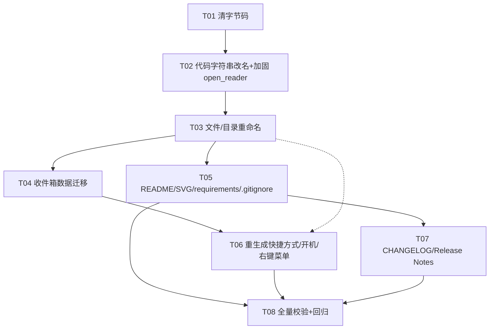

# 剪思盒 / ClipThink 增量架构设计与任务分解（DESIGN）

> 文档类型：增量架构设计 + 实施任务分解（在已有可运行工具基础上的「品牌统一 + Bug 修复 + GitHub 文档/发布」）
> 文档负责人：架构师 高见远
> 日期：2026-07-23
> 关联 PRD：`PRD-clipthink-rebrand.md`（产品经理 许清楚）
> 关联仓库：https://github.com/JohnWish1590/clipthink

---

## 0. 设计结论摘要（给 team-lead）

- **改名边界已锁定**：只改「本产品自己的名字」，凡指向底层 AI 引擎（WorkBuddy 桌面端 / `codebuddy` CLI）的描述**保留不改为产品名**（与 PRD §2.3 一致）。
- **目录/文件/收件箱命名**全部采纳 PRD §2.1 建议值：`ClipThink` / `clipthink_sender.pyw` / `clipthink_reader.pyw` / `ClipThinkInbox`。
- **Bug 根因已验证**：`__pycache__` 存在陈旧 `WorkBuddySender.cpython-313.pyc`、`WorkBuddyReader.cpython-313.pyc`，运行加载旧字节码导致 `NameError: name 'subprocess' is not defined`。`subprocess` 在源码顶层已正确 import（sender L18）。修复 = 清字节码 + 加固 `open_reader`。
- **额外发现（重要）**：当前 `.gitignore` **未忽略 `ClipThinkInbox/` 与 `**/.workbuddy/`**，且 `.workbuddy` 含 `memory/automations`，存在敏感数据入库风险；同时 `add_to_startup.py` / `register_context_menu.py` 等 README 公开步骤依赖的脚本被 `.gitignore` 忽略，克隆用户无法复现。需在任务中修正。

---

## 1. 改名映射表（最终版）

### 1.1 总原则（改名边界）

| 类别 | 处理 | 说明 |
|---|---|---|
| 产品自身名称/目录/文件/用户可见文案/快捷方式/右键菜单/架构图 | **改** | 「WorkBuddy 收件箱」→「剪思盒 / ClipThink」 |
| 底层引擎依赖描述（WorkBuddy 桌面端、`codebuddy` CLI、`CODEBUDDY_CLI`、`CODEBUDDY_GATEWAY_AUTH`、阅读器「继续讨论」里指向引擎的「WorkBuddy」、关于页免责声明、`.workbuddy` 子目录） | **不改** | 是对真实外部依赖的如实描述，改了会误导用户或破坏功能（PRD §2.3） |
| logo 字母 `W` | **改** | → `剪`（产品首字；视觉品牌决策已定） |
| hotkey | **不改** | 本机 `hotkey.json` 为 `ALT+Q`，文件优先于默认值 `ALT+4`；仅文档说明，不改动代码 |

### 1.2 逐文件改动点（按文件列出 旧值 → 新值）

#### 1.2.1 `clipthink_sender.pyw`（原 `WorkBuddySender.pyw`）— P0/P1

| # | 行 | 旧值 | 新值 | 级别 |
|---|---|---|---|---|
| S1 | 3-8（文档注释） | `WorkBuddy 收件箱热键监听器` / `发到 WorkBuddy 收件箱` | `剪思盒 热键监听器` / `发到 剪思盒` | P1 |
| S2 | 77 | `INBOX = r"C:\Users\user\WorkBuddyInbox"` | `INBOX = r"C:\Users\user\ClipThinkInbox"` | P0 |
| S3 | 92 | `你是 WorkBuddy 收件箱分析助手` | `你是 剪思盒（ClipThink）分析助手` | P1 |
| S4 | 93 | `遍历 C:\\Users\\user\\WorkBuddyInbox 下所有…` | `遍历 C:\\Users\\user\\ClipThinkInbox 下所有…` | P0 |
| S5 | 86-87（注释） | `分析WorkBuddy收件箱待处理文件` | `分析剪思盒待处理文件` | P1（注释） |
| S6 | 221（docstring） | `写入 WorkBuddyInbox` | `写入 ClipThinkInbox` | P1 |
| S7 | 509 | `READER_SCRIPT = os.path.join(BASE_DIR, "WorkBuddyReader.pyw")` | `READER_SCRIPT = os.path.join(BASE_DIR, "clipthink_reader.pyw")` | P0 |
| S8 | 694 | `Icon("WorkBuddySender", …)` | `Icon("ClipThink", …)` | P0 |
| S9 | 697 | `f"WorkBuddy 收件箱 - 运行中 ({combo})"` | `f"剪思盒 - 运行中 ({combo})"` | P0 |
| S10 | 116（logger 名） | `log = logging.getLogger("wb-sender")` | `log = logging.getLogger("clipthink")` | P2 |

> 注：`CODEBUDDY_CLI`（L83）、`CODEBUDDY_GATEWAY_AUTH`/`CODEBUDDY_DISABLE_REQUEST_VALIDATION`（L557-558）**不改**（引擎依赖）。

#### 1.2.2 `clipthink_reader.pyw`（原 `WorkBuddyReader.pyw`）— P0

| # | 行 | 旧值 | 新值 | 级别 |
|---|---|---|---|---|
| R1 | 1（注释） | `WorkBuddy 收件箱阅读器 —— 纯后台 HTTP 服务` | `剪思盒阅读器 —— 纯后台 HTTP 服务` | P1 |
| R2 | 70 | `INBOX = os.path.join(os.environ.get("USERPROFILE", "C:\\"), "WorkBuddyInbox")` | `INBOX = os.path.join(os.environ.get("USERPROFILE", "C:\\"), "ClipThinkInbox")` | P0 |

#### 1.2.3 `reader.html`（前端）— P0/P1/P2

| # | 行 | 旧值 | 新值 | 级别 | 决策 |
|---|---|---|---|---|---|
| H1 | 6 | `<title>WorkBuddy 收件箱阅读器</title>` | `<title>剪思盒阅读器</title>` | P0 | 改 |
| H2 | 131 | `<div class="logo">W</div>` | `<div class="logo">剪</div>` | P2 | 改（视觉品牌） |
| H3 | 132 | `<h1>WorkBuddy 收件箱阅读器</h1>` | `<h1>剪思盒阅读器</h1>` | P0 | 改 |
| H4 | 153 | `选中内容后按此键即发到 WorkBuddy。` | 保留 `WorkBuddy`（指底层引擎，§2.3 不改项） | P1 | **保留** |
| H5 | 310 | `想就这条跟 WorkBuddy 进一步聊？…点「发到 WorkBuddy 讨论」` | 保留 `WorkBuddy`（指底层引擎） | P1 | **保留** |
| H6 | 315 | `也可先点上方「复制全文」，直接粘贴给 WorkBuddy。` | 保留 `WorkBuddy`（指底层引擎） | P1 | **保留** |
| — | 164-169（关于/版权） | `名称：剪思盒 (ClipThink)` / `github.com/JohnWish1590/clipthink` / 免责 `Workbuddy 官方…` | 已正确 | — | 不改 |

> 说明：H4/H5/H6 三处「WorkBuddy」实际描述「把内容发到 WorkBuddy 引擎做分析」这一**事实**，属于 PRD §2.3 明确「不改」的边界，故保留，避免误导用户。这与关于页免责声明（保留 Workbuddy 字样）自洽。

#### 1.2.4 文件系统重命名

| 旧 | 新 | 方式 |
|---|---|---|
| `C:\Users\user\WorkBuddySender\` | `C:\Users\user\ClipThink\` | OS 重命名目录（git 仓库以 `.git` 标识，父目录改名不影响仓库） |
| `WorkBuddySender.pyw` | `clipthink_sender.pyw` | `git mv`（保留提交历史） |
| `WorkBuddyReader.pyw` | `clipthink_reader.pyw` | `git mv` |
| `C:\Users\user\WorkBuddyInbox\` | `C:\Users\user\ClipThinkInbox\` | **数据迁移（移动）**，见任务 T04，非单纯改名 |

#### 1.2.5 辅助/运维脚本（P1；多数为 `.gitignore` 已忽略的本地脚本，改名后须同步以防入口失效）

统一做 3 类替换：`WorkBuddySender`→`ClipThink` / `WorkBuddyReader`→`clipthink_reader` / `WorkBuddyInbox`→`ClipThinkInbox`；菜单键 `SendToWorkBuddy`→`SendToClipThink`；标题/描述「WorkBuddy 收件箱」→「剪思盒」。逐文件关键行：

| 文件 | 关键行 | 旧 → 新 |
|---|---|---|
| `register_context_menu.py` | 5 | `SENDER_DIR = r"C:\Users\%s\WorkBuddySender"` → `r"C:\Users\%s\ClipThink"` |
| | 6 | `send_to_workbuddy.ps1` → `send_to_clipthink.ps1` |
| | 8 | `key_path = …\SendToWorkBuddy` → `…\SendToClipThink` |
| | 11 | `发送到 WorkBuddy 分析` → `发送到 剪思盒 分析` |
| `unregister_context_menu.py` | 3 | `…\SendToWorkBuddy` → `…\SendToClipThink` |
| `add_to_startup.py` | 5 | `…\WorkBuddySender\WorkBuddySender.ahk` → `…\ClipThink\clipthink_sender.ahk`（若保留 ahk）或指向 `.pyw` |
| | 8 | `WorkBuddySender.lnk` → `ClipThink.lnk`（或 `剪思盒.lnk`） |
| | 18 | `SetWorkingDirectory(r"…\WorkBuddySender")` → `…\ClipThink` |
| | 19 | 描述 `WorkBuddy 收件箱发送热键（开机自启）` → `剪思盒 发送热键（开机自启）` |
| `make_reader_shortcut.py` | 2（doc） | `WorkBuddy 阅读器` → `剪思盒 阅读器` |
| | 11 | `READER = …"WorkBuddyReader.pyw"` → `…"clipthink_reader.pyw"` |
| | 13 | `WorkBuddy 阅读器.lnk` → `剪思盒 阅读器.lnk` |
| | 22 | 描述 `WorkBuddy 收件箱阅读器` → `剪思盒 阅读器` |
| `make_desktop_shortcut.py` | 10 | `inbox = r"…\WorkBuddyInbox"` → `…\ClipThinkInbox` |
| | 12 | `WorkBuddy收件箱.lnk` → `剪思盒.lnk` |
| | 22 | 描述 `WorkBuddy 收件箱 - 双击查看待分析内容` → `剪思盒 - 双击查看待分析内容` |
| `update_all_shortcuts.py` | 5-6 | `WorkBuddySender.bat` / `WorkBuddySender` → `ClipThink\clipthink_sender.bat`（若保留 bat）或 `.pyw` / `ClipThink` |
| | 9-12 | `启动 WorkBuddy 收件箱.lnk` / 描述 → `启动 剪思盒.lnk` / `剪思盒 发送热键（Alt+4，Python 版）`；`WorkBuddySender.lnk` → `ClipThink.lnk` |
| 其它 `fix_*.py` / `make_*.py` / `*_shortcut.py` / `test_*.py` / `clean_inbox.py` / `fix_encoding.py` / `send_clipboard.py` / `send_to_workbuddy.ps1` / `WorkBuddySender.{ahk,bat,vbs}` | 全文 | 全量替换上述 3 类旧名；其中 `send_to_workbuddy.ps1` 建议**重命名为 `send_to_clipthink.ps1`** 并改其 `$Inbox`；`WorkBuddySender.{ahk,bat,vbs}` 已废弃 → 重命名为 `clipthink_sender.{ahk,bat,vbs}` 或直接删除（不进仓库，见 §5 风险6） |

> 这些脚本大多在 `.gitignore` 中（见 §5 风险8），不会进公开仓库；但若本机改名后直接运行它们去「重生成入口」，旧硬编码路径会指向已不存在的 `WorkBuddySender` 目录，故**必须同步改后再重跑**。

#### 1.2.6 `README.md` — 全文用户可见改名 + 新增五章

- 全文替换：`WorkBuddy 收件箱`→`剪思盒 / ClipThink`；`WorkBuddySender.pyw`→`clipthink_sender.pyw`；`WorkBuddyReader.pyw`→`clipthink_reader.pyw`；`WorkBuddyInbox`→`ClipThinkInbox`；`WorkBuddySender\`→`ClipThink\`。
- **保留** §2.3 中 `WorkBuddy 桌面端`、`C:\Program Files\WorkBuddy\…\codebuddy`、免责声明等引擎真实依赖描述。
- 在「一、项目概述」前新增 **「快速开始 / Quick Start」** 区块，含 5 章：前置条件 / 安装 / 快速部署 / 启动 / 依赖（详见 §4 与 PRD §4.1）。
- 新增对 `requirements.txt` 的引用。

#### 1.2.7 `功能架构图.svg` — 文字标签

| 行 | 旧值 | 新值 |
|---|---|---|
| 2（`<title>`） | `WorkBuddySender 功能架构与数据流` | `ClipThink 功能架构与数据流` |
| 10（`<text>` 主标题） | `WorkBuddySender 功能架构与数据流` | `ClipThink 功能架构与数据流` |
| 24（发送端框标题） | `WorkBuddySender.pyw · 发送端运行时` | `clipthink_sender.pyw · 发送端运行时` |
| 43（收件箱框） | `WorkBuddyInbox/` | `ClipThinkInbox/` |
| 52（模型执行） | `WorkBuddy 模型执行` | **保留**（指引擎，§2.3 不改项） |
| 15（热键示例） | `ALT+Q` | 保留（与本机 `hotkey.json` 一致） |

#### 1.2.8 新增文件

| 文件 | 内容 | 来源 |
|---|---|---|
| `requirements.txt` | `pystray`、`Pillow`、`pywin32`（tkinter 为标准库不列） | PRD §4.1/§4.4 |
| `CHANGELOG.md` | 按 Keep a Changelog 规范，含 `[1.0.0]`（Added/Changed/Fixed/Removed） | PRD 附录 A |
| `RELEASE_NOTES.md` | v1.0.0 Release 描述正文（定位/亮点/快速开始/已知限制/免责） | PRD 附录 B（同时用作 GitHub Release 正文） |

#### 1.2.9 `.gitignore` 调整（PRD §4.4 + 本设计新增发现）

- **新增忽略**（防敏感/用户数据入库）：`ClipThinkInbox/`、`**/.workbuddy/`。
- **取消忽略**（使公开仓库可复现 README 步骤）：`add_to_startup.py`、`register_context_menu.py`、`unregister_context_menu.py`、`make_reader_shortcut.py`、`make_desktop_shortcut.py`（其余 `fix_*.py`/`test_*.py`/`clean_inbox.py`/`fix_encoding.py`/`send_clipboard.py`/`send_to_*.ps1`/`WorkBuddySender.*` 维持忽略）。

---

## 2. Bug 修复方案：托盘「打开阅读器」无响应

### 2.1 根因（已验证）

- 现象：右键托盘 →「打开阅读器」无反应；`log.txt` 报 `NameError: name 'subprocess' is not defined`。
- 真相：`clipthink_sender.pyw` **第 18 行已有 `import subprocess`**，且在 `open_reader()` 与 `ensure_serve()` 中正确使用。报错来自运行进程加载了**陈旧的 `__pycache__` 字节码**（`WorkBuddySender.cpython-313.pyc` / `WorkBuddyReader.cpython-313.pyc`，mtime 早于本次源码修正），旧字节码里 `import subprocess` 缺失/位置不当，且改名前因 mtime/校验未触发重编译。
- 实证：目录下确实存在 `__pycache__\`，内含上述两个 `.pyc`（已 `ls` 确认）。

### 2.2 修复步骤

1. **（关键）清理陈旧字节码**：删除 `WorkBuddySender\__pycache__\` 整目录（含所有 `*.pyc`）。改名发布时文件名变更天然失效，但需显式删除一次（任务 T01）。
2. **（确认）导入位置**：`import subprocess`（sender L18）与 `import webbrowser`（已在 `open_reader` 内）均在调用前就绪，无需逻辑改动。
3. **（加固）`open_reader`**：先检测 8765 端口是否已监听 → 未监听才拉起后端 → 拉起后**短暂等待端口就绪**再开浏览器 → 异常时弹明确错误提示（任务 T02）。杜绝「后端未起就开浏览器导致空白页」与旧字节码隐患。

### 2.3 涉及文件与代码位置

| 文件 | 位置 | 动作 |
|---|---|---|
| `clipthink_sender.pyw` | L18 | 确认 `import subprocess` 在模块顶层（已满足，保留） |
| `clipthink_sender.pyw` | L512-521（`open_reader`） | 按下方示例加固 |
| `clipthink_sender.pyw` | L524-534（`_port_listening`） | 复用，无需改 |
| `WorkBuddySender\__pycache__\` | 整目录 | 删除（T01） |

**加固后的 `open_reader`（替换原 L512-521）：**

```python
def open_reader(icon, item):
    try:
        port = 8765
        # 若后端未运行，先拉起（端口占用时阅读器会自动只开浏览器）
        if not _port_listening(port):
            pythonw = sys.executable
            subprocess.Popen([pythonw, READER_SCRIPT], creationflags=CREATE_NO_WINDOW)
            # 等待后端就绪（最多约 3s），避免浏览器打开时服务还没起
            for _ in range(30):
                if _port_listening(port):
                    break
                time.sleep(0.1)
        import webbrowser
        webbrowser.open("http://127.0.0.1:8765/")
        log_info("已启动/打开阅读器")
    except Exception as e:
        log_err(f"打开阅读器失败：{e}")
        # 异常时给用户明确提示，而不是静默无响应
        threading.Thread(
            target=show_toast,
            args=("打开阅读器失败，详见日志",),
            kwargs={"kind": "err"},
            daemon=True,
        ).start()
```

### 2.4 验收标准（同 PRD §3.5）

- [ ] 清 `__pycache__` 后启动 `clipthink_sender.pyw`，托盘出现；
- [ ] 右键「打开阅读器」→ 浏览器打开 `http://127.0.0.1:8765/`，页面正常；
- [ ] 后端未运行时被拉起（8765 监听），已运行时仅开浏览器不重复拉起；
- [ ] `log.txt` 含 `已启动/打开阅读器`，全量搜索 `NameError` 为 0；
- [ ] 重复点击 3 次均正常（单实例：端口占用仅开浏览器）。

---

## 3. 部署依赖清单 + 「3 步跑起来」

### 3.1 依赖清单

| 依赖 | 用途 | 是否随改名改 |
|---|---|---|
| Windows 10/11 | 运行平台（RegisterHotKey / pywin32 / 托盘） | — |
| **WorkBuddy 桌面端**（提供 `codebuddy` CLI，路径 `C:\Program Files\WorkBuddy\resources\app.asar.unpacked\cli\bin\codebuddy`） | 分析引擎（真实外部依赖） | **不改名**（§2.3） |
| Node.js（`node`） | 用 `node codebuddy --serve` 拉起本地分析服务 | — |
| Python 3.11+ | 运行 `.pyw` | — |
| Python 包：`pystray`、`Pillow`、`pywin32`（`win32com`） | 托盘 / 图标 / 快捷方式·注册表 | — |
| `tkinter` | 剪贴板读取与轻量提示（Python 标准库） | — |
| `git` | 克隆仓库 | — |

### 3.2 GitHub 克隆后「3 步跑起来」

```text
1) 前置：Windows 10/11 + 已装 WorkBuddy 桌面端（提供 codebuddy CLI）+ Node.js + Python 3.11+
2) 获取代码：
      git clone https://github.com/JohnWish1590/clipthink
      cd clipthink
      pip install -r requirements.txt
3) 启动：
      pythonw clipthink_sender.pyw
   （可选）python add_to_startup.py            # 开机自启
   （可选）python register_context_menu.py     # 资源管理器右键「发送到 剪思盒 分析」
   浏览器访问 http://127.0.0.1:8765/ 查看阅读器
```

---

## 4. 任务列表（有序 + 依赖 + 实现顺序）

### 4.1 任务表

| 任务ID | 任务名 | 改什么（文件/动作） | 依赖 | 优先级 |
|---|---|---|---|---|
| **T01** | 清理陈旧字节码 | 删除 `WorkBuddySender\__pycache__\` 整目录（含 `WorkBuddySender/Reader.cpython-313.pyc`） | 无 | P0 |
| **T02** | 代码字符串改名 + 加固 open_reader | `clipthink_sender.pyw`（S1-S10，含加固 §2.3）、`clipthink_reader.pyw`（R1-R2）、`reader.html`（H1-H3，H4-H6 保留） | T01 | P0 |
| **T03** | 文件/目录重命名 | `git mv WorkBuddySender.pyw→clipthink_sender.pyw`、`git mv WorkBuddyReader.pyw→clipthink_reader.pyw`；OS 重命名目录 `WorkBuddySender→ClipThink` | T02 | P0 |
| **T04** | 收件箱数据迁移 | 移动 `WorkBuddyInbox\` 下全部用户数据（`.md`/`.md.done`/图片/其它）到 `ClipThinkInbox\`；**不迁移** `.workbuddy`（引擎重建）；旧目录可保留为空或删除 | T03 | P0 |
| **T05** | 文档与图示更新 | `README.md` 全文改名 + 新增「快速开始」五章；`功能架构图.svg` 文字标签（§1.2.7）；新增 `requirements.txt`；更新 `.gitignore`（§1.2.9） | T03 | P0 |
| **T06** | 重生成全部入口 | ① `python unregister_context_menu.py`（删旧 `SendToWorkBuddy`）→ 改 `register_context_menu.py` → `python register_context_menu.py`（新 `SendToClipThink`）② `python update_all_shortcuts.py`（桌面+开机）③ `python make_reader_shortcut.py`（阅读器）④ `python add_to_startup.py`（开机自启）；先改这些脚本内的旧路径/标题（§1.2.5）再跑 | T03, T04 | P0 |
| **T07** | 发布文档 | 新增 `CHANGELOG.md`（PRD 附录 A）、`RELEASE_NOTES.md`（PRD 附录 B，作 v1.0.0 Release 正文） | T05 | P1 |
| **T08** | 一致性全量搜索 + 回归验证 | 全仓 `grep -i "WorkBuddySender\|WorkBuddyReader\|WorkBuddyInbox"`：核心文件须 0 命中（H4-H6/引擎描述/免责除外）；启动 `clipthink_sender.pyw` 验证「打开阅读器」正常（§2.4） | T05, T06, T07 | P0 |

> 实现顺序严格遵循：T01 → T02 → T03 → {T04, T05} → T06/T07 → T08，与 PRD 要求一致。

### 4.2 任务依赖图（Mermaid）



### 4.3 关键执行要点（给工程师）

- **T01/T02 前务必先退出托盘**（避免文件占用导致重命名失败）。
- **T03 目录重命名**：git 以 `.git` 目录标识仓库，父目录改名不影响 git；建议先 `git mv` 两个 `.pyw`（仍在旧目录内），再 OS 重命名父目录，最后 `git add -A`。
- **T04 迁移**：用 `shutil.move` / `robocopy /E /XJ`（排除 junction）移动；**排除 `ClipThinkInbox\.workbuddy`**。迁移后确认原 `.md.done` 仍在。
- **T06 顺序不可乱**：必须先 `unregister` 旧右键菜单键，再 `register` 新键，否则旧 `SendToWorkBuddy` 残留。
- **T08 回归**：重点验证 §2.4 五项；并检查桌面 3 个 `.lnk`、开机 `ClipThink.lnk`、右键菜单均指向新路径。

---

## 5. 待确认 / 风险提示（针对 PRD §6 七项 + 补充发现）

| # | PRD 风险 | 架构师处理建议 | 风险等级 |
|---|---|---|---|
| 1 | 命名是否采用 PRD 建议值？ | **采纳** PRD §2.1 全部建议值（`ClipThink` / `clipthink_sender.pyw` / `clipthink_reader.pyw` / `ClipThinkInbox`）。任务 brief 已锁定，无需再问主理人。 | 低 |
| 2 | 重命名会破坏现有入口（桌面 3.lnk / 开机.lnk / 右键菜单） | 已纳入 **T06** 并明确顺序：先 `unregister` 旧键 → 改脚本 → `register` 新键 → `update_all_shortcuts` → `make_reader_shortcut` → `add_to_startup`。**补充排查**：发布前额外检查「任务计划程序（`schtasks`）」「开始菜单/Quick Launch」「`AppData\Roaming\Microsoft\Windows\SendTo`」，以及是否有其它 `.lnk` 指向旧路径；用全局搜索兜底（T08）。 | 高 |
| 3 | 收件箱数据迁移方式 | 见 **T04**：移动全部用户数据到 `ClipThinkInbox`；**不迁移 `.workbuddy`**（引擎会话产物，由 codebuddy 重建，且含 `memory/automations` 敏感内容）；保留原 `.md`/`.md.done`。迁移后即删旧 `WorkBuddyInbox`（或留空目录）。 | 中 |
| 4 | 「继续讨论」里 WorkBuddy 是否改产品名？ | **建议保留「WorkBuddy」**（选项 a）。这三处指向底层分析引擎（事实描述），属 PRD §2.3「不改」边界，与关于页免责声明自洽；改产品名会误导用户「以为是剪思盒自己分析」。README 中明确「产品调用 WorkBuddy 桌面端做分析」。 | 中 |
| 5 | 页头 logo 字母 W→? | **定为「剪」**（产品首字），已写入 `reader.html` H2（§1.2.3）。视觉品牌决策已定。 | 低 |
| 6 | 旧启动器（.ahk/.bat/.vbs / send_to_workbuddy.ps1）去留 | 建议：随改名**重命名** `send_to_workbuddy.ps1→send_to_clipthink.ps1`（并改其 `$Inbox`）以保右键菜单发送链路可用；`WorkBuddySender.{ahk,bat,vbs}` 已废弃、且在 `.gitignore` 中，可**直接删除**或仅重命名为 `clipthink_sender.{ahk,bat,vbs}`（不进仓库）。不影响主流程（主流程用 `.pyw`）。 | 中 |
| 7 | `hotkey.json`=ALT+Q 与默认 ALT+4 不一致 | **不改热键**。README「设置/自定义热键」章明确「文件优先于默认值」：本机生效 `ALT+Q` 因 `hotkey.json` 内容为 `ALT+Q`；代码默认 `ALT+4`。任务列表标注「热键不改」。 | 低 |
| 8 | **（补充发现）** 生成脚本被 `.gitignore` 忽略，但 README 公开步骤依赖它们 | 当前 `.gitignore` 忽略了 `add_to_startup.py`/`register_context_menu.py`/`unregister_context_menu.py`/`make_*.py`/`*_shortcut.py`，但 README §4.1 又要求用户 `python add_to_startup.py` 等。克隆用户将无法复现。**建议**：取消忽略 `add_to_startup.py`/`register_context_menu.py`/`unregister_context_menu.py`/`make_reader_shortcut.py`/`make_desktop_shortcut.py`（见 §1.2.9）。 | 中 |
| 9 | **（补充发现）** `.gitignore` 未忽略 `ClipThinkInbox/` 与 `**/.workbuddy/` | 当前 `.gitignore` 未忽略收件箱目录与 `.workbuddy`；`.workbuddy` 含 `memory/automations`（可能含令牌/会话）。公开前**必须**加 `ClipThinkInbox/`、`**/.workbuddy/` 到 `.gitignore`，并确认 `log.txt`/`.sender.lock`/`.reader.lock` 已忽略（已忽略）。见 §1.2.9。 | 高（安全） |

---

> 文档结束。落地实现见任务 T01–T08（工程师）/ 仓库公开见任务 #4（team-lead 协调）。
